# Workshop TIBCO Spotfire

## Lab Guide

### Authors
Steven van der Kroft 
svanderk@tibco.com \
Alain Martens
amartens@tibco.com

Click here to learn about TIBCO

Learn all about TIBCO on our website:
[www.tibco.com](https://www.tibco.com/)

Additional info can be found the TIBCO Community:
[community.tibco.com](https://community.tibco.com/)

**Table of Contents**
   * [Workshop TIBCO Spotfire](#workshop-tibco-spotfire)
      * [Lab Guide](#lab-guide)
         * [Authors](#authors)
      * [Introduction](#introduction)
      * [Guided Lab 1: Getting started](#guided-lab-1-getting-started)
         * [Task 1: Start your free 30-day trial of TIBCO Cloud Spotfire](#task-1-start-your-free-30-day-trial-of-tibco-cloud-spotfire)
         * [Task 2: Loading data](#task-2-loading-data)
         * [Task 3 Discover and validate the Data](#task-3-discover-and-validate-the-data)
      * [Guided Lab 2: The basics](#guided-lab-2-the-basics)
         * [Task 1: Explore by searching](#task-1-explore-by-searching)
      * [Guided Lab 3: Working with the Analyst](#guided-lab-3-working-with-the-analyst)
         * [Taks 1 Installing the Analyst client](#taks-1-installing-the-analyst-client)
         * [Task 2 Exploring the Cloud Analyst](#task-2-exploring-the-cloud-analyst)
         * [Task 3 training a model in Spotfire](#task-3-training-a-model-in-spotfire)
         * [Task 4 Validate the model](#task-4-validate-the-model)
         * [Task 5 Predict from the model](#task-5-predict-from-the-model)
      * [Summary](#summary)
      * [Feedback](#feedback)
      * [Appendix A](#appendix-a)

## Introduction

Today you will experience how TIBCO Spotfire can support you discovering valuable insights from your data. More precisely you will use Spotfire to load data, validate the data, discover insights and even use machine learning to create a model that can make predictions.  \
 \
This workshop is designed for anybody that has an interest in data and data analysis and does not require any experience with Spotfire nor Machine learning.

The workshop is part of a series of workshops. Each workshop focuses on 1 of the capabilities of the TIBCO Platform. These workshops can be followed stand-a-lone. However following multiple workshops will provide you with additional insights in how the components in the TIBCO Platform work together as a whole and provide tools and capabilities to embrace the digital transformation.

Today we will be starting in the Spotfire Business Author client, which is a web based client that allows users to work in Spotfire without requiring an installed client. The last part of this workshop will make use of the Analyst client which gives some additional capabilities for more advanced users, such as training and evaluating models, performing clustering, etc.

The data that we will be working with today is data about loans. Let’s assume you work as a risk management analyst for a financial institution that provides loans. When doing so we would like to know what the purpose of the loan is, what the balance on the current account is, but also what the credit score of the customer is.

We will first start to load the data into Spotfire and validate if it's ready to be analyzed. Then we will start to discover insight from the data.

Finally if we discovered what customers profiles have a good credit rating, we will create a model that will predict for new customers if they will have a good or bad credit rating based on it's profile.

## Guided Lab 1: Getting started 
### Task 1: Start your free 30-day trial of TIBCO Cloud Spotfire 

Complete these steps to obtain access: 

Please click [this link](https://eu.account.cloud.tibco.com/signup/spotfire) and get registered with your business email address.

You'll be taken directly into the Spotfire application (to our "Welcome" page). You will need to activate your account and create a password before logging in for a second time. Check your inbox for an activation email and instructions.

Your 30-day trial comes with 2 each of our Analyst, Business Author and Consumer roles so you can try out team management, sharing and application building. In addition, each user will get generous library storage ranging from 100-250 GB.

We recommend using Google Chrome (46.x or higher) or Mozilla Firefox (42.x or higher).

### Task 2: Loading data 

In order to analyze the data you will need to download the data files which have been prepared by you. You can download the [lab files zip file here](https://github.com/TIBCONL/spotfireworkshop/archive/master.zip)! 
Once downloaded, please extract them on your local machine. You'll find the data files in the 'lab files' folder.

You’ll start with an empty screen inviting you to take action.
<!--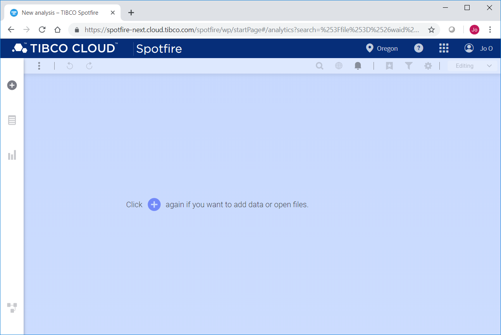-->
To start analyzing we require data to be loaded in Spotfire. To do so perform the following; Drag and drop all 3 files from the folder Exercise 1 onto this screen. 

<!--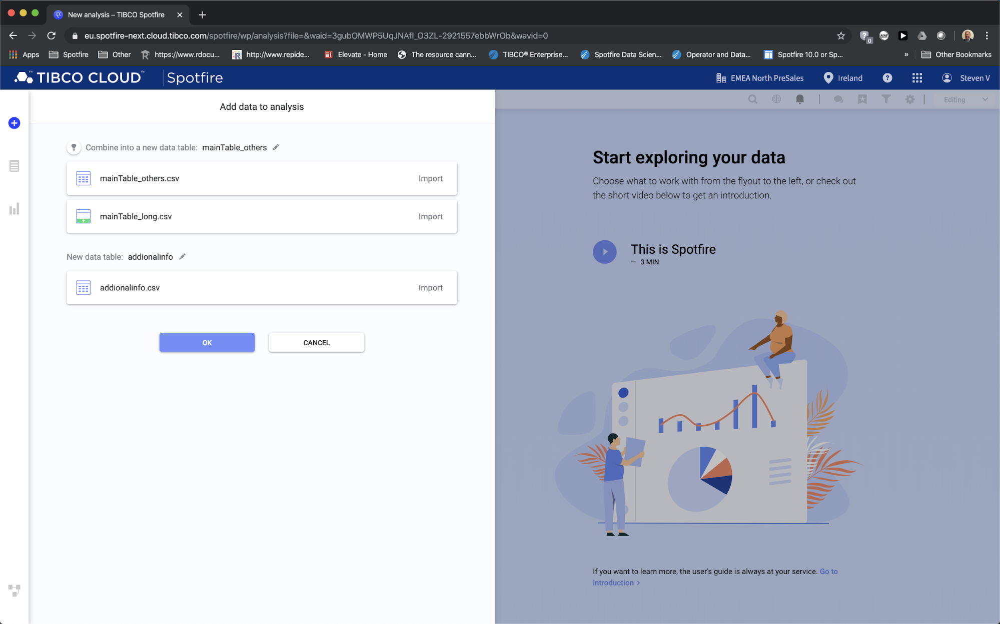-->

Now let's check the screen. Spotfire has suggested to add rows from mainTable_long.csv to mainTable_others.csv. This is indicated by the flashing light bulb <!----> . Which tells you that Spotfire automatically applied a recommendation. Since the structure of the two tables is (almost) the same, therefore the recommendation is made to add the rows of the 2nd data table to the first one. If you click on the second data file (mainTable_long.csv) you will see this recommendation and you can validate that what Spotfire has done automatically is appropriate for your data by clicking on the <!---->  symbol. Now click OK or cancel to go back to the previous screen.

For the table based on file additionalinfo.csv no recommendation has been made and Spotfire has suggested to add this data file as a separate data table. We would like, however, to add the columns in this dataset to the other table. We can do so by clicking on the data file (additionalinfo.csv) and changing the “Add as new table” setting to “Add as Columns to”. 

<!--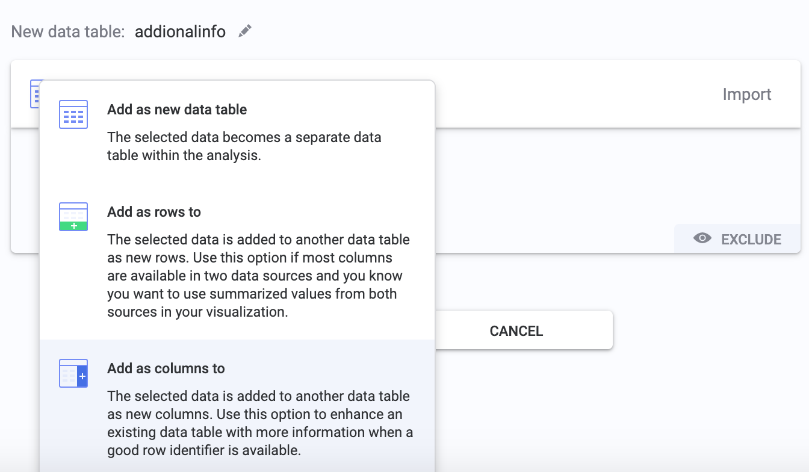-->

It should tell you that it will add the columns to “mainTable_others” table. Again you can click on the <!----> 
symbol to see the way the columns will be added. To go back click ok and again ok on the next screen. It will then show you the screen informing you that you data is ready.

<!--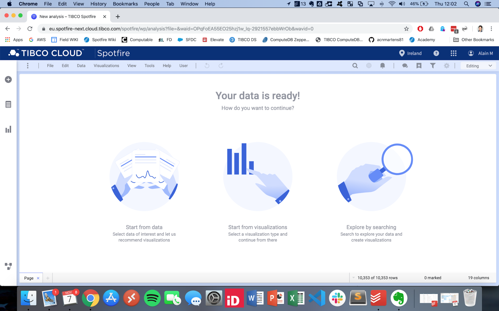-->

Let’s check the Data Canvas <!---->  (button (bottom left)) before exploring the data!

<!--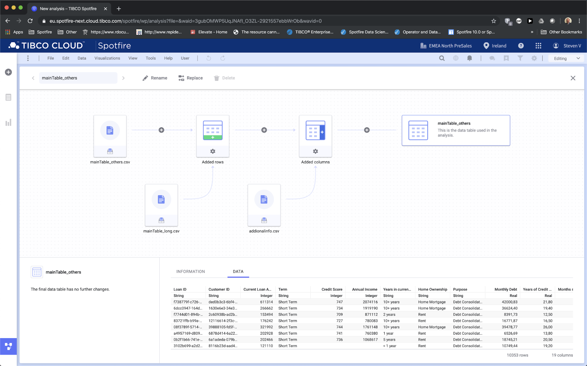-->

This page shows you how the data Table in Spotfire is created. You see that rows are added from mainTable_long.csv to mainTable_others.csv. After that the columns from additionalinfo.csv are added to the same table. This all results in 1 datatable that is composed of the three individual files. 

Please note that when you click on the nodes in the top row the respective number of rows and columns is displayed in the bottom right corner of the screen. For example, if you click on the top left node (mainTable_others.csv) you will see that the number of columns is 14. However if you click on the 'Added rows' node you will see that you the number of columns is 15. Can you explain this difference? \
Note that each step is still editable by clicking on the <!---->  symbol for the respective step. This way we ensure that you can always correct or modify any decisions that you have made in the process. You can also add additional steps, for example add a transformation, by clicking on the + sign on the lines, or click on a file to replace it with another file.

Finally check the lower half of the screen to preview the data of the final table, or the way the table looks after each step by selecting that step in the canvas on the top. Let’s close the data canvas by clicking on the Data canvas button on the bottom left of the screen again. This should bring you back to the page stating you data is ready.

### Task 3 Discover and validate the Data

Now that the data is loaded we can click on the “Start from Data button” to validate our data, this will open the data panel. Please note that if your screen is no longer empty after you've added some visualisations you can also get to the data panel by clicking on the middle button on the left top <!----> .
This will open your data panel that allows you to check your data and get a feeling for the columns and values in your data. In the data panel, you'll see all the columns in your dataset. Please note that your columns have been put into different subsections. For example numbers, categories, id's, etc. Next to the fact that this allows you to quickly find what you're looking for, this categorization is being used by Spotfire to suggest the best possible recommendation for visualizing your data.

Click for example on 'Annual income' and then on the <!---->  icon.

This will give you information about the selected column. What is the min, max, average and median value. How is it categorized, what data type is it, etc. You can always change the formatting or default aggregation method so Spotfire takes that into account when visualising the data.
<!--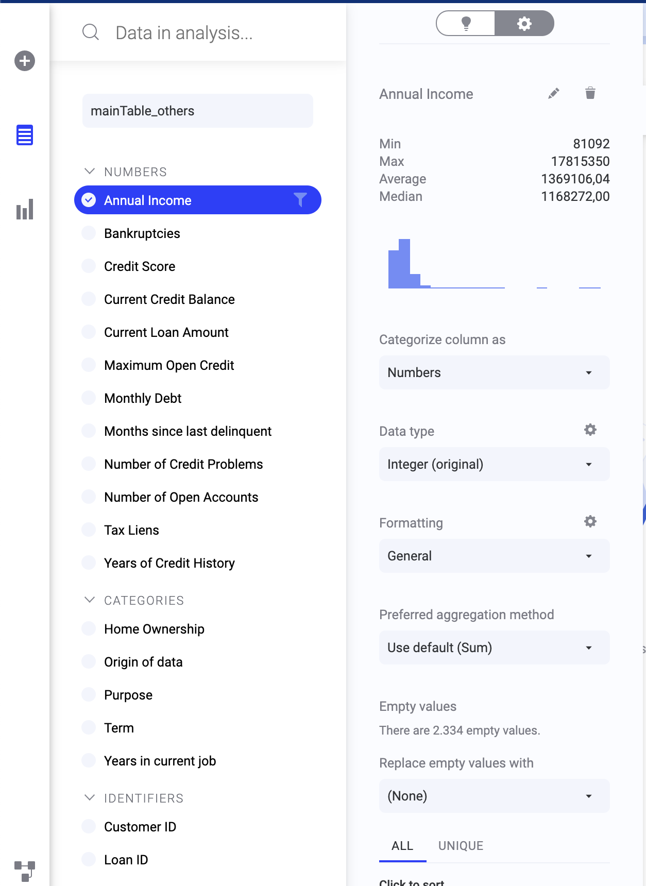-->

Lets select 'Credit Score' by clicking on the name of the column. The values in this column can be between 300 (worst) and 850 (best) however the actual range in the data is different. Please verify if the values are within the possible range. 

Should you want to filter down to a specific range then you can use the filter for the column by clicking on the <!---->
icon in the data panel. 

As this is a number that is more interesting to see as an average than as a sum, let's change the default aggregation method to average. We do this since the sum of 'Credit Score' has no meaning, where as the average has. 

Spotfire also might suggest actions based on the contents of the selected column. In this case it sees empty values and provides the option to replace empty values with the 'previous value', 'next value' or eg. 'a fixed value'. Similarly if you select the column 'purpose' you will get the option to Split the column, as it contains characters like an _ or a space.

The categorization that Spotfire suggest is important for the recommendation engine. If a number is an identifier it should be treated differently than a real number. Therefore you have the option to change the categorisation.

**[What happened]** \
At this stage we have loaded data from 3 data files into Spotfire and created a single data table from them. We have validated the data and were able to make changes to them where needed. Now we should be in good shape to start analysing the data.

## Guided Lab 2: The basics 
### Task 1: Explore by searching 

Let’s click on the explore by search button to start exploring the data. A box pops up with the question “What are you interested in?”. Let’s type “credit score”.

As soon as you start typing Spotfire will start to recommend visualisations based on the things you type.

<!--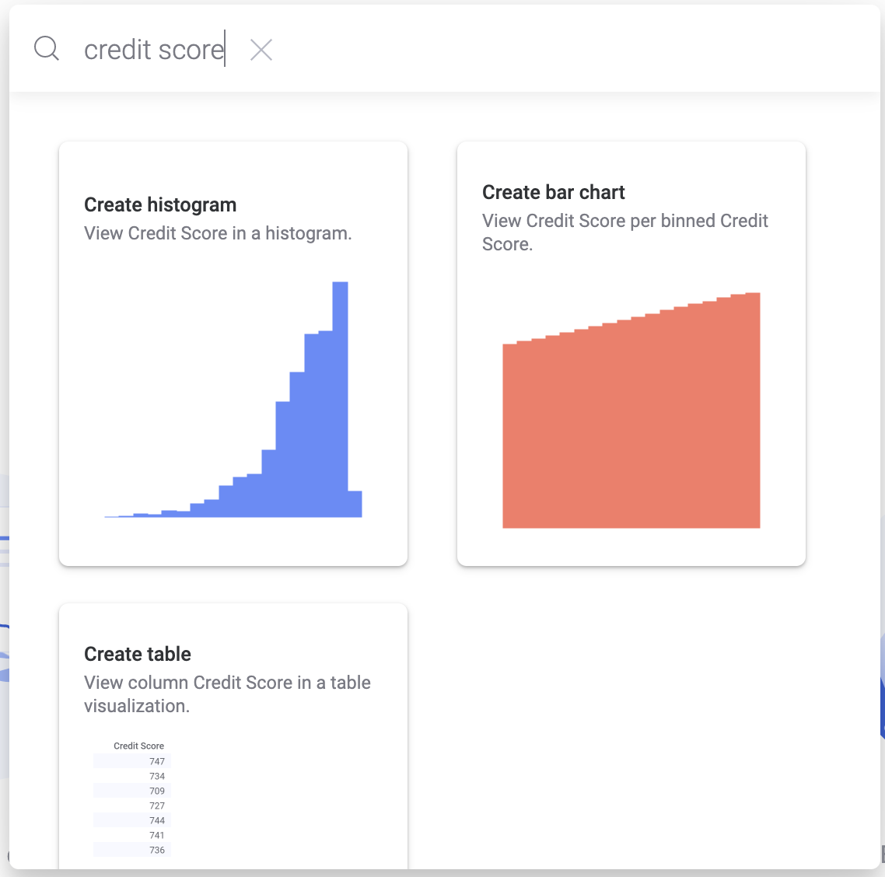-->

Click on the histogram and see how it is added to the dashboard.
Now click on the search bar and continue typing “ vs income”.

<!--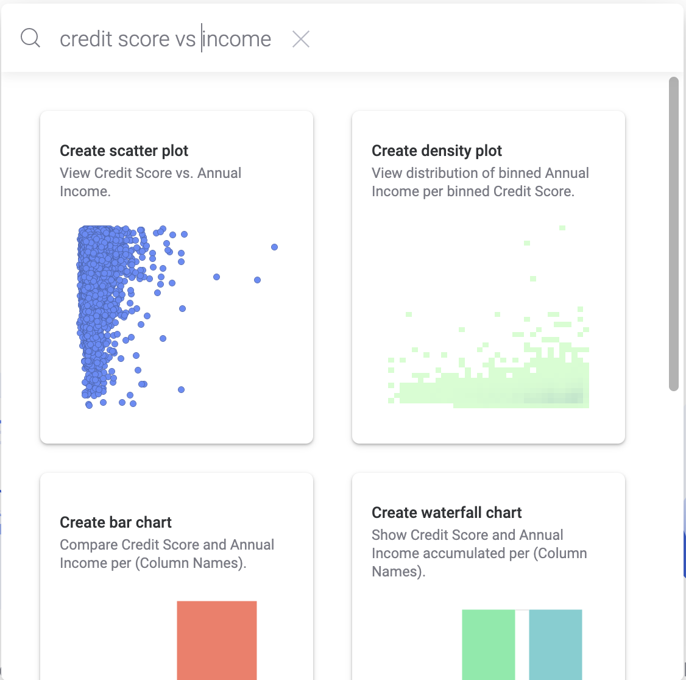-->

At any point you can add visualisation to your dashboard by clicking it, or grabbing it and position it on your dashboard. Let’s also add the first Scatter plot to the page. Try and position it at the right side of the page by dragging and holding before releasing it there.

Now let’s try something a little more challenging and type “problems vs credit score, income and accounts” and choose the parallel coordinate plot and drag it to the bottom left corner.

Now you should have a page that looks like the screenshot below. Tip; if you'd like to rearrange your visuals then click and hold the title of the visual you'd like to move and drag it to a different location on the page (or even a different page if it yet exists).  

<!--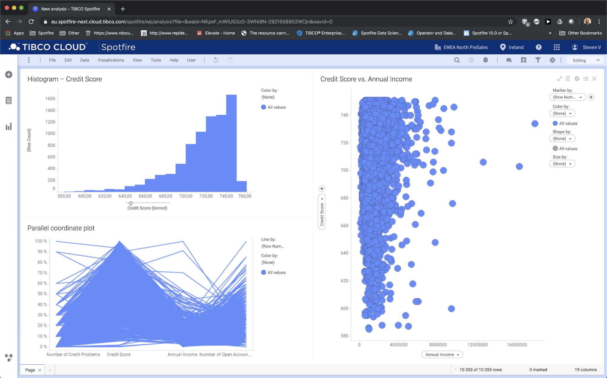-->

You have now created a first version of a dashboard by just typing in some questions. Let's spend a little to understand what these visuals are telling us. Tip; To help you focus on a specific visual you might want to maximize it. To do so click on the <!---->
incon in the title of a visual. This will maximize your visual. You are able to click through the different visuals in a maximized way or restore the original layout.

The histogram tells us that the credit score has a somewhat skewed distribution with a slight tendency towards the lower spectrum. This means that the majority of the credit scores are above the median. 

The scatter plot shows us how credit scores and annual income are related. As the cloud of points is bigger towards the top of the visual we could conclude that the higher the income the higher the credit score. 

The parallel coordinate plot is a visual that can be used to find profiles in your data. Similar lines in that case represent similar behaviour. At a first glance you see that certain lines are different indicating that these might be outliers.

Looking at the scatter plot at the right, we see that there are 3 clear outliers on the right hand side of the graph. Let’s try and mark these by drawing a box around them with your mouse and see what happens. Alternatively you can mark items by drawing a lasso. To do this hold down your 'Alt' key while you click, hold and draw a shape around the points with your left mouse held down.

<!--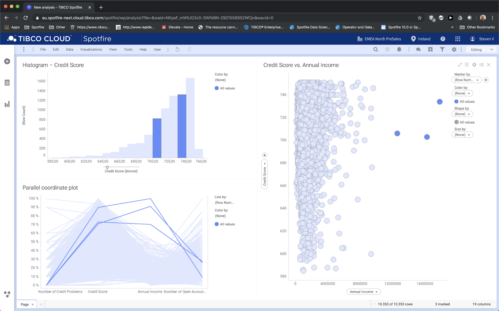-->

The brush linking in Spotfire highlights the respective elements in all visualizations in order to get a more clear picture about these specific points. Now do a right mouse click on one of the 3 dots and choose “create detail visualization” and then choose table. This will add a table that responds to the selection made in the scatter plot. Select some other points and see how the contents of the table changes by showing the details of the newly marked dots. You have now created a drill down visualization.

Drill down visualizations are very useful when you're performing data discovery using Spotfire. It allows you to ask interactive questions about you data. Drill down visualizations give you the ability to quickly zoom into interesting parts of your data and discover valuable insights. 

To finalise this exercise open the data panel and drag the 'purpose' column onto the scatter plot and drop it on the colour pallete that shows up.

Tip; To quickly find the 'purpose' column you can use the start typing the name of the column in the search filter on top of the data panel to filter the column names that match your input. 

You should now have a page looking like this;

<!--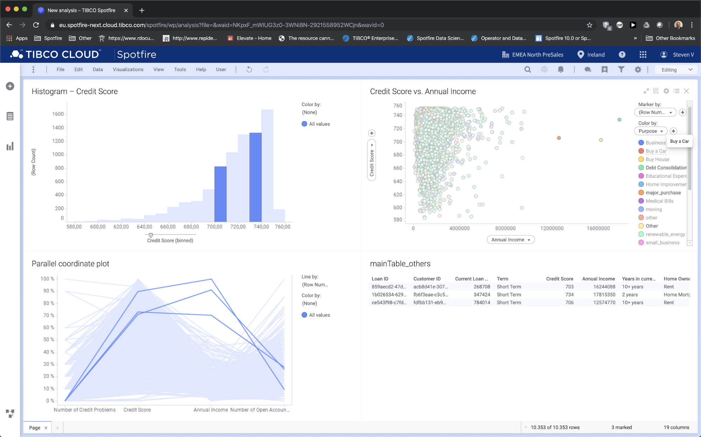-->

### Task 2: Start from visualizations 

Let’s add a second page to the analysis by clicking on the + sign next to the Page tab on the bottom of the screen. Now on the new page click on start from visualisations.

<!---->

Let’s choose the Treemap. Please notice how data is suggested depending on the visualization type chosen. You see that Spotfire selected the 'Home Ownership' as a Hierarchy and the 'Monthly Debt' for the Color and Size. We have learned in the previous exercise that we can drag and drop elements from the data panel to reconfigure visualisations.

<!--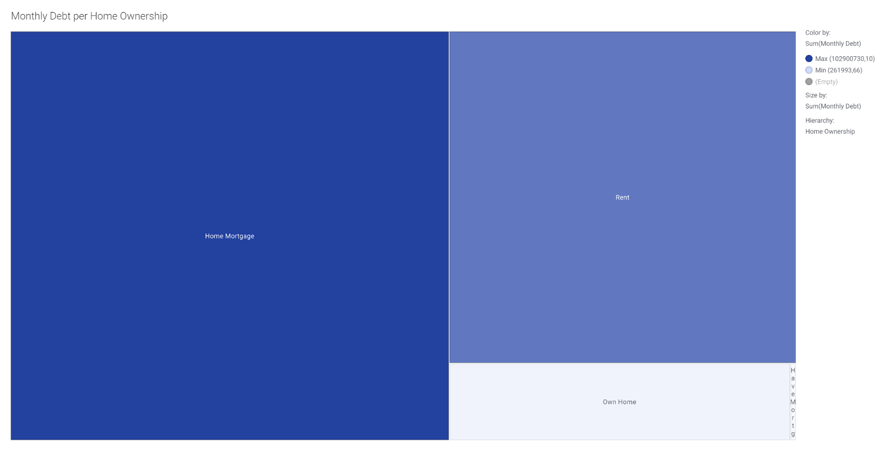-->

Try to change the treemap to a visualization where the Hierarchy is based on the 'purpose' the size by the 'Monthly Debt' and the colour by the 'number of credit problems'.

<!--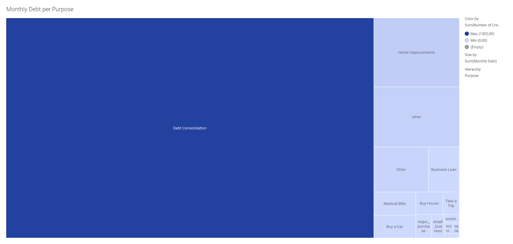-->

Now change the aggregation of the number of credit problems to an average and make the max red and the min green by clicking on the coloured circles in the legend and choose the colour you want to use. Now you can immediately see the purpose where on average the most credit problems occur.

<!---->

What's very obvious from this visualization is that the majority of the loans has a purpose for consolidating debt. Meaning that people are combining multiple loans into 1 new loan with a relatively low number of credit problems. When you hover over the red square in the visual you'll notice that relatively more problems exist with loans for vacations.

Let’s save our work so far into the library by choosing file save as library item from the menu. If the menu does not show, click the three dots on the left top corner of the top bar.

<!--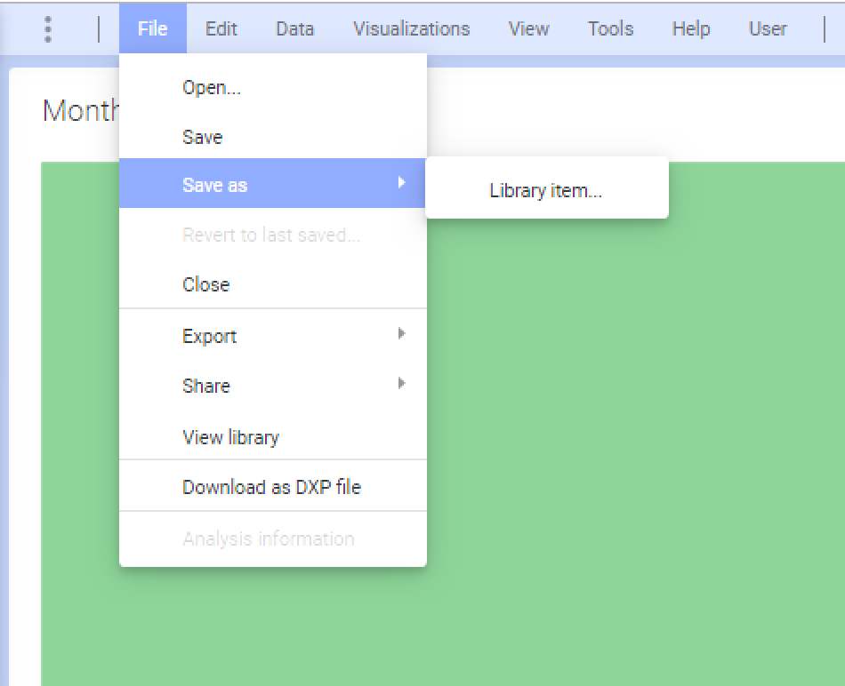-->

Give it an appropriate name and save your analysis file. This file can now be opened by other users that have access to the library and the specific folder. 

This concludes the basic exercises. Now we will be getting into some advanced tasks. In order to do so we will install the Spotfire Analyst Client that provides access to more advanced Spotfire features.

## Guided Lab 3: Working with the Analyst

### Taks 1 Installing the Analyst client

If you do not have an installed client on your machine you can go through this exercise. Also if your installed client is not of version 10.6.0 you might want to install it, as the exercises assume you are on this version and will continue with the dashboard we've saved earlier. You can install the Cloud Analyst next to a Spotfire Analyst that you might already have.

In order to download the analyst go to the File menu and click “View Library”.

Now on the left menu you will see Downloads. Click on that and you will get the option to download the client installer.

While running through the installer, as an administrator, you can accept all the defaults.

Please note; that you select the right region (EMEA) when starting Spotfire. 

Note 2; It might be that Spotfire asks you to upgrade. The cloud server is updated regularly. Updates to the installed client are distributed automatically. To benefit from the latest features, please upgrade your client.

### Task 2 Exploring the Cloud Analyst

Although the look and feel is similar to the Spotfire Business Author which we have used in the previous exercise, the Cloud Analyst comes with several more features.  \
Let’s start by opening the file from the library that we have created and saved in Lab 2.

Now let's create a 3rd page by clicking on the + sign next to the page(2) tab on the bottom of the screen.

Tip; You can quickly rename the page titles by double clicking on the names on the tabs. Just type in the name you like and when you're finished hit enter or click elsewhere.

<!---->

Now let’s start by searching as we did in the business author and type “income” in the search bar. One of the things you will notice is that, next to directing you to a 'income' related visual in the dashboard, Spotfire now suggest visualizations based on data correlations in the data set that it automatically has identified. Apparently 'income' has a correlation with 'term' and 'monthly debt'!

<!---->

Let’s choose the scatterplot that shows the relationship with Term & Monthly debt. Now lets mark the three items on the scatter plot most to the right. Again you can do this by holding down the alt key on your keyboard and drawing a lasso around these items (using the Alt key + mouse).

<!--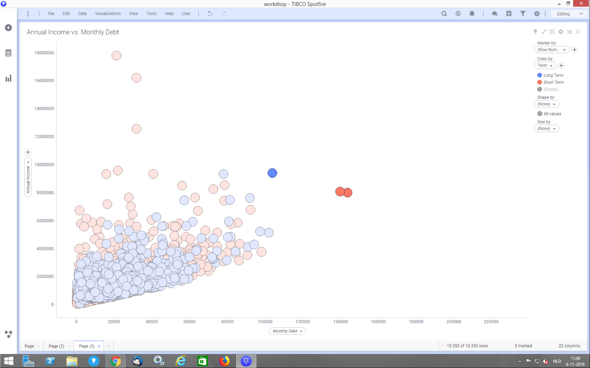-->

Now click on 'Recommendations based on marked data' which is the light bulb symbol (the first icon in the row on the right hand side of the title bar of the scatterplot). Spotfire will now apply Machine Learning to find out how these outliers, that have a relatively high monthly debt in relation to their annual income, are different from the rest.

Scroll down and choose the relationship with 'tax liens' from the suggested visualizations. 

<!--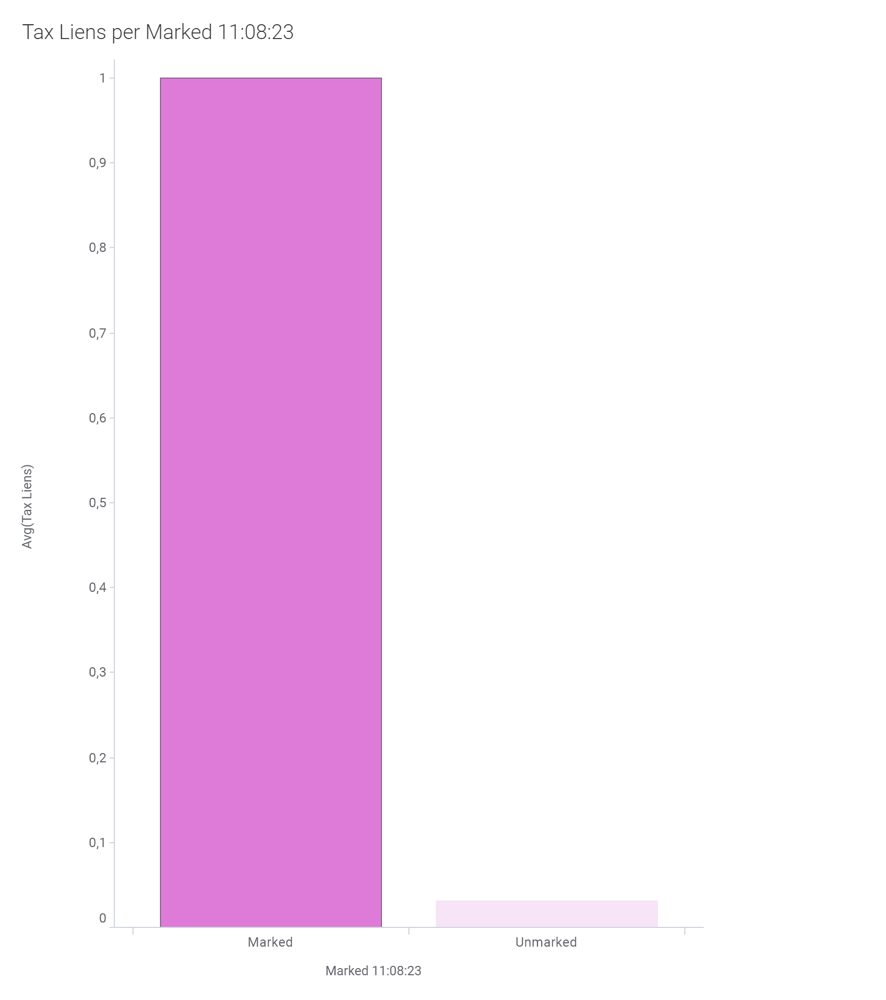-->

You will notice that the average tax liens is very different for the marked vs. unmarked items.

Note: A lien is a right to keep possession of property belonging to another person until a debt owed by that person is discharged. A tax lien is a lien imposed by law upon a property to secure the payment of taxes. A tax lien may be imposed for delinquent taxes owed on real property or personal property, or as a result of failure to pay income taxes or other taxes.

This shows how Spotfire does not only help you to determine how to visualize your data based on the type of data, but also helps you to discover correlations in your data using Machine Learning without the need for a Data Science degree.

Now lets add another page and create a visualization that shows the profile of the customer based on some characteristics. \
In order to do this, let’s add a line chart. On the Y-axis we are going to add average 'monthly debt', average 'credit score', average 'annual income', sum 'number of open accounts' and sum of 'bankruptcies'. 

Hint; Use the plus sign on the y axis selector to add new columns. 

For the x-axis select (Column names). In the legend change 'line by' to (CustomerID). Also in the legend select to remove the 'Color By'.

<!--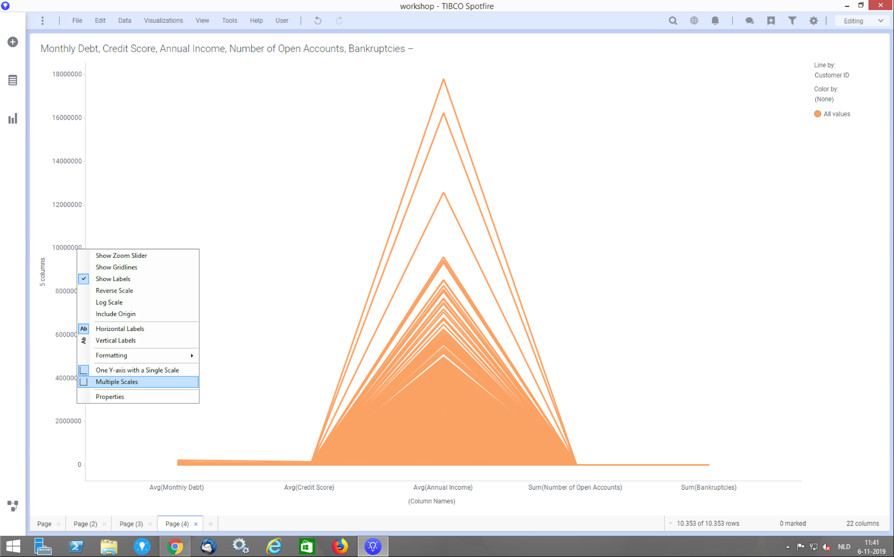-->

If all is well your visualization should match the one as depicted above. 
If it doesn't, it might be that your locale settings of your system are different. For Spotfire to deal with this situation we can transform the 'Monthly Debt' column. In order to do this please follow the steps in Appendix A (at the end of this document). 

In this visual each line represents a customer in the dataset. The lines show a profile of the customer based on the selected characteristics. Finally right click on the y axis scale and choose Multiple Scales do get to the image below.

<!--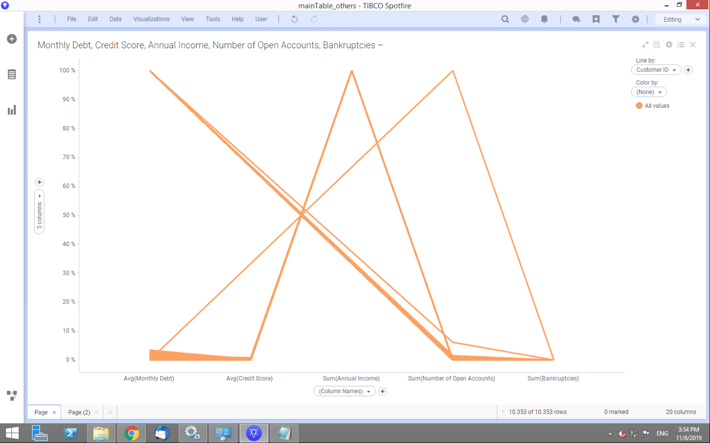-->

Now we would like to cluster customers into sets of customers with similar profiles. In order to do so we can use the out of the box functionality in Spotfire. Right click on the visualization and select K-Means clustering form the context menu.

Make sure your settings are as shown below:

<!---->

Now Spotfire will create a number of clusters of customers with similar characteristics. A new column called 'K-means clustering' has been created automatically to the data table.  \
I have coloured by the 'k-means cluster' column in the sample below. Also note that the visual has automatically been trellised by this column. This means that a separate visual has been created for each distinct value in this the 'k-means cluster' column.

<!---->

You can see the different customer profiles clearly in the sample.

Cluster 1 eg. contains customers that have a high monthly debt, above average credit score, average annual income but little open accounts and few bankruptcies.

Compare this to cluster 2 where customers have low monthly dept, a low credit score, high annual income and also few open accounts and bankruptcies.

The lines in clusters 2 and 3 look very similar in shape. Can you explain what the difference is between clusters 2 and 3 using Spotfire?

Hint: use the data panel and the recommendations for the k-means clustering column. If you have figured it out, check the visual on the next page to validate.

<!---->

<!---->

As you can see above, the Machine Learning in Spotfire can help us determine the correlations with the 'K-means Clustering' column and the rest of the dataset.  As it turns out, clusters 2 and 3 have different behaviour when it comes to the combination of 'Annual Income' and 'Monthly Debt' which gives us the answer how these clusters are different.

Next to that, apparently some of the customers have not been assigned to any cluster as they do not match the most common patterns.

### Task 3 training a model in Spotfire

Now that we have a thorough understanding of our customers, their profiles, etc. we might want to create a model that could help us predict for a new customers if they will have a good or bad credit rating based on their characteristics. 

For this we are going to add 2 new data tables to Spotfire. You will find these tables in the folder Exercise 2. There are 2 tables, 1 with a dataset that will be used to train a model and the other one that will be used to test (validate) the model. 

Add the 2 files by dragging and dropping them on the Spotfire Analyst.

The analyst shows an additional step when adding tables, ie. the import settings where you can make changes to the data types, ignore columns, etc. In this case we are just going to click “OK” on both screens.

Make sure to add both tables as new tables to the analysis file. Check this by clicking on the tables and choose add as new table.

<!--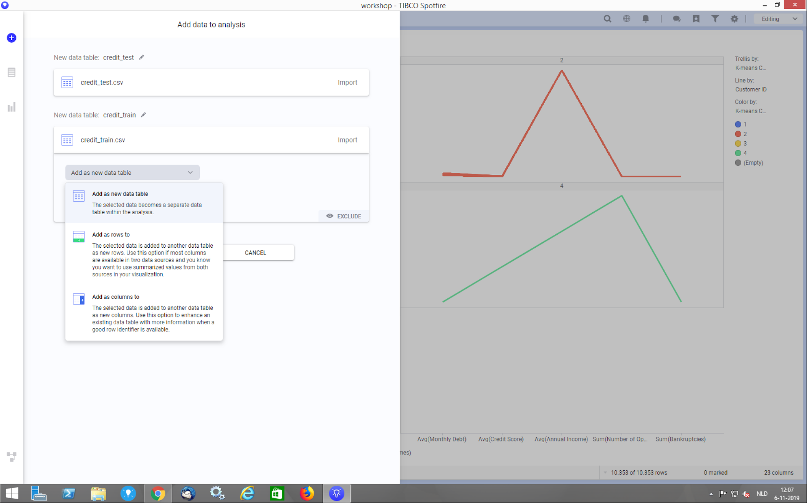-->

Once the tables have been added feel free to get familiar with the dataset by exploring the data panel as we have done in the first exercise. One thing you will notice is that there is a column named 'class', that contains the values 'good' or 'bad', which indicates whether or not the customer has a good or bad credit rating.

As we'll see Spotfire has built in functionality to create predictive analytics models. 

Now in order to train a model we are going to the tools menu and will  choose classification modeling. As shown in the screenshot below.

<!--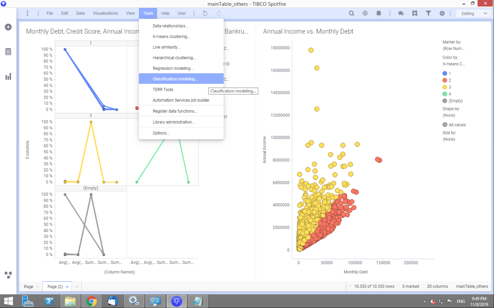-->

This will bring up the following screen:

<!--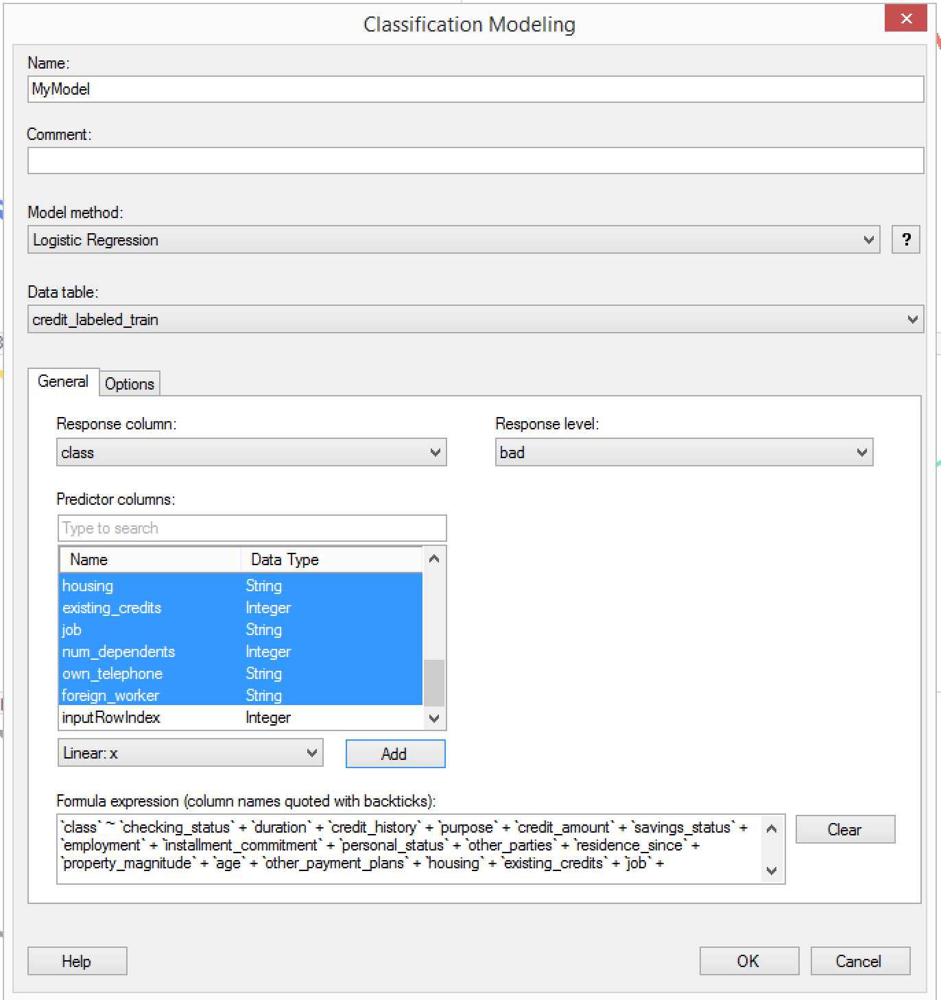-->

if you are not familiar with models or classification models in particular, click on the "Help" button and read the explanations  provided. Spotfire provides a very good context specific help at any time. 

If you feel ready lets select the logistic regression as a model method and choose the credit_labeled_train data table. In the general area we are going to create a model that predicts the column 'class'. Therefore we choose 'class' as dependent column and the response level we want to predict is the value “bad”.

As predictor columns select and add all remaining columns except 'inputRowIndex', as this has no relevance to whether or not a customer has a good or bad credit rating.

Once you are all set, click ok and Spotfire will start to train a model. After Spotfire completed this task you should see the Model Summary page similar to the one below.

<!---->

In order to get familiar with the Model Summary Page, you can click on the question mark in the Model Summary title bar. One of the model results shown on the page is the Variable importance. This chart tells you how important each characteristic is in relation to the predicted class. Click on the <!---->  icon to maximize the visualization and see what the most important predictors are.

<!---->

Click on the <!---->

 again to resize the chart to its’ original size.

Tip: \
If you'd like to focus on specific parts of the visual you can add a zoom slider. To do so right click on the values on the y-axis and select 'Show zoom slider'. 

In the list with available diagnostics visualisations click on the ROC curve. This will add the visualization to the page now click on the <!---->

to maximize the visualization. For an ideal model should the ROC curve should approach the line that goes from (0,0) up to (1,0) and then to (1,1). If you would randomly select the predicted values the line would go diagonal from (0,0) to (1,1). So the more the the line is lifted from the diagonal line the better it predicts the values. A way of putting a value to the ROC cure is to look at the AUC (Area Under Curve). The higher the better.

<!--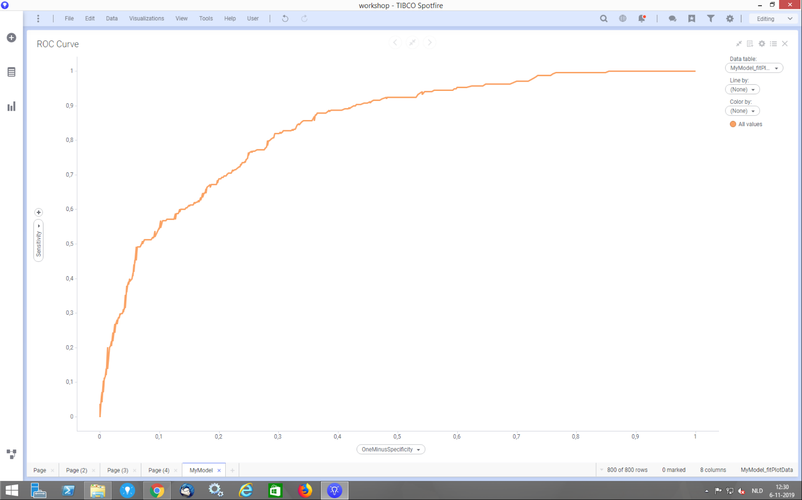-->

Although the model is not perfect it is  doing a pretty good job. In order to improve the model we can remove predictor columns that have little impact (a low variable importance) to see if that improves the model. Resize the ROC curve visualization to its original size.

### Task 4 Validate the model

Let us now validate the model using the test data set that we have added as well. When validating a model we will have the model predict the class for data that the model was not trained on and then compare the prediction to the actual class. In order to do this, click on the <!---->  'evaluate model' icon.

In the screen that pops up, choose “credit_labeled_test” as the data table. As all the column names match we can simply click ok. If this would not be the case we could indicate which predictors for the model are represented by what columns in the table.

<!---->

Once completed a new page will be added with the evaluation summary. An interesting statistic is the model accuracy that indicates how well the model did predict the class for the test dataset. In our case is was 74.5% accurate in its prediction. Another method for checking model performance is the confusion Matrix. Here predicted values are compared to the observed values and in each combination the number of cases are mentioned.

<!--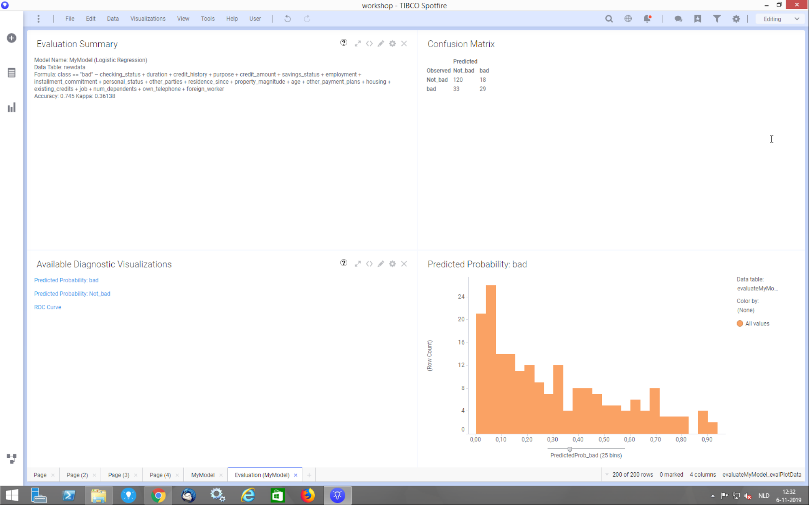-->

### Task 5 Predict from the model

As a final step in this exercise let us now add a final dataset to the analysis with data of which we do not know if the customers have a good or bad credit rating and predict that using our model.

In the Folder Exercise 3 there is one file named 'credit_unlabeled'. Add this to the analysis. By now you should know how to do this. Hint: Make sure you add it as a new data table.

From the 'MyModel' page click on the predict from model icon <!---->
.
This will bring up a pop up similar to the one we saw when we validated the model. Now choose the “credit_unlabeled” table as the data table and click OK. This will add a couple of colums to the data table.

To see the effect add a new page to the analysis and a table visualization that shows the “credit_unlabeled” data table, using the table selector at the top right. If you scroll to the last column in the visualization you will see a column has been added with the predicted class. The values in the column are  “bad” or “not bad”. The reason for this is that our model predicts the class “bad”. Similarly we could have created a model that predicted the class “good”.

There is also a new column added with the name probprediction which contains the probability that the class would be classified as “bad”.  If the value is closer to 1 the model is quite certain that the class would be “bad” and classified it as such. If the value is closer to 0 then the model will have classified it as “not bad”. When considering to give a loan to these customers we should be careful with the customers that have a predicted class of “bad” and especially the ones that have a very high probability.

Congratulations!!! You've reached the end of the exercises of this workshop!

## Summary

During the workshop we started out registering for a TIBCO Spotfire cloud evaluation account and then  loaded and combined a couple of files in Spotfire Business author. This was the web client you used.

After that we checked the data canvas and you learned how to evaluate the data using the data panel. From there we started to visualize the data by initially typing in questions and then by starting from the visualizations and creating a detail visualization allowing us to drill down into the details.

Once we had our first dashboard created we installed the cloud analyst client and looked at the additional recommendations it provides based on the correlations in the data. We also looked at Spotfire analysing the outliers in a scatter plot.

From there we moved into some more advanced topics, where we created clusters of our customers based on their profiles using K-Means clustering. We ended up training, validation and predicting from a classification model using logistic regression. 

We hope you have started to appreciate the capabilities that support you in getting insights from your data faster than any other tool in the market and allows to grow from simple visualization to taking the first steps into machine learning using the embedded tools. 

In the Data Science workshop we will extend this further using TIBCO Data Science.

## Feedback
Thank you for attending the TIBCO Spotfire Workshop.
We constantly like to improve our workshops. Therefore we kindly ask you to complete [this feedback form](https://forms.gle/dcW6GmZzAg5ysytE6).
(If you're also attending the Data Science in the afternoon you can fill out the feedback form after the Data Science workshop.)

## Appendix A

If the locale of your system is not set to The Netherlands then a comma might not be interpreted as a decimal separator. This causes the column 'Monthly Debt' to be classified as a category value instead of a numeric value. 

To deal with this situation, we can add a transformation for this column to parse the value as a numeric value. To do so, open the data canvas and click the last plus sign (just before the last node) and select 'add transformation'. 

<!--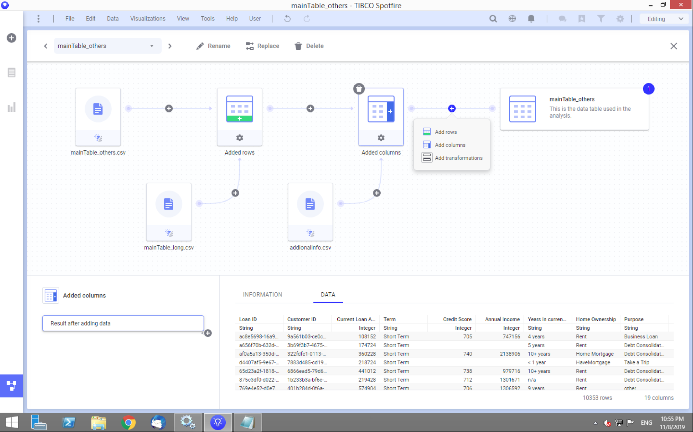-->

Next select 'Calculate and replace column' and click 'insert'. 

Here's we'll add an expression to replace the 'Monthly Debt' column. So make sure to select 'Monthly Debt' as the column to replace (on top). And for the expression use the following;  

ParseReal([Monthly Debt], "nl" )

When you hit the preview button you should see the result of this calculation. 

<!---->

